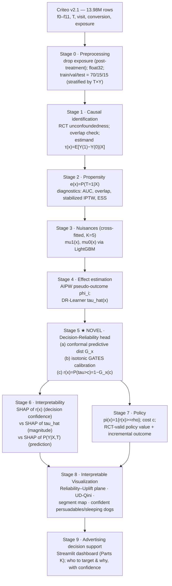

# Causal Inference-Driven Interpretable Visualization for Advertising Effect Analysis
## Research Design & Literature-Gap Document (Phase 1 — for approval before implementation)

> **Status:** This document delivers Parts **A → J** requested before implementation
> (literature gap, candidate novelties, selected novelty, architecture, math, baselines,
> SOTA, ablation plan, metric plan, visualization plan). **No modelling code is written until
> you approve the novelty + architecture.** Phase-2 implementation (notebook, models, plots,
> Streamlit, saved artifacts, research summary) begins only on your sign-off.

---

## 0. Dataset ground truth (verified on the actual file, not assumed)

The full file was pulled from the official HuggingFace mirror (`criteo/criteo-uplift`,
`criteo-research-uplift-v2.1.csv.gz`, **311,422,618 bytes**, matching the repo's Git-LFS oid).
All numbers below were computed by a streaming pass over **all 13,979,592 rows**.

| Quantity | Value | Implication for the study |
|---|---|---|
| Rows | **13,979,592** | Matches "≈13.98M". Full-data evaluation is feasible with memory discipline. |
| Columns | `f0…f11`, `treatment`, `conversion`, `visit`, `exposure` | 12 continuous covariates + T + 2 outcomes + 1 post-treatment flag. |
| `treatment` mean | **0.85000** (treated 11,882,655 / control 2,096,937) | **85/15 split → control is the scarce arm.** Motivates X-Learner, stabilized IPTW, and careful CI widths on control-side estimates. |
| `visit` rate | **0.046992** (T: 0.048543, C: 0.038201) | Naïve ATE = **+0.010342** (**+27.1%** relative). Non-trivial, learnable signal. |
| `conversion` rate | **0.002917** (T: 0.003089, C: 0.001938) | Naïve ATE = **+0.001152** (**+59.4%** relative). **Extremely rare** → unstable per-instance signal. |
| `exposure` mean | 0.030631 | **Post-treatment** ("ad actually served"): a mediator/collider. **Excluded** from covariates and never used as an outcome. |
| Propensity AUC (lit.) | ≈ 0.509 | Assignment is near-random ⇒ **unconfoundedness holds by design**; `e(x)≈0.85` ~ constant. |

**Primary-outcome decision (evidence-based, per your instruction not to default to conversion):**
`visit` is selected as the **primary** outcome; `conversion` is a **secondary stress-test** outcome.
Justification: (i) conversion base rate 0.29% yields ~6.1k positive conversions in a 2.1M test arm split
across 85/15, making per-decile uplift and calibration estimates high-variance and CI-dominated;
(ii) visit at 4.70% gives ~3 orders more positive signal for stable CATE, calibration, and uncertainty
estimation; (iii) the Criteo benchmark literature (Diemert et al. 2018) and UpliftBench (2026) both treat
visit as the well-powered target. We still report **all** metrics on conversion as a robustness stress test,
explicitly flagging where estimates are statistically indistinguishable from zero.

---


## PART A — Literature Survey (41 works, grouped A–F)

**Reading note.** Each row condenses the requested dimensions (Author/Year · Domain · Treatment→Outcome ·
Method/Causal estimator · Interpretability · Visualization · Uncertainty · Policy · Main result · Limitation/Gap · Relevance).
Foundational works are dated pre-2020; the survey is weighted toward 2022–2026. Details for 2026 preprints are
drawn from abstracts and are flagged as such. Content from external sources was rephrased for compliance.

### A. Causal inference foundations & HTE estimators

| # | Author (Year) | Estimator / Method | Interp. | Viz | Uncertainty | Policy | Main result & gap · relevance |
|---|---|---|---|---|---|---|---|
| 1 | Rubin (1974); Splawa-Neyman (1923/1990) | Potential-outcomes / ATE | – | – | – | – | Defines Y(1),Y(0), ATE=E[Y(1)−Y(0)]. Gap: population-level only. Relevance: our estimand base. |
| 2 | Rosenbaum & Rubin (1983) | Propensity score e(x)=P(T=1|X) | – | – | – | – | Balancing score; adjustment/matching. Gap: point est., no HTE. Relevance: Part G diagnostics. |
| 3 | Robins, Rotnitzky & Zhao (1994) | IPW / AIPW (doubly robust) | – | – | asymptotic | – | DR consistent if outcome **or** propensity correct. Relevance: our pseudo-outcome backbone. |
| 4 | Hirano, Imbens & Ridder (2003) | Efficient IPW | – | – | ✓ (SE) | – | Nonparametric-propensity IPW attains efficiency bound. Relevance: stabilized weights. |
| 5 | Hill (2011) | BART for causal | partial | – | Bayesian CI | – | Flexible response surfaces; posterior intervals. Gap: scaling to 14M. Relevance: uncertainty precedent. |
| 6 | Chernozhukov et al. (2018) | Double/Debiased ML (DML) | – | – | ✓ (Neyman-orth.) | – | Cross-fitting + orthogonal scores remove regularization bias. Relevance: our cross-fitting + DR-learner. |
| 7 | Wager & Athey (2018) | Causal Forest | feature imp. | partial | **pointwise CI** | – | Consistent, asymptotically normal CATE with CIs. Gap: CIs used descriptively, not for decisions. Relevance: SOTA baseline + uncertainty comparator. |
| 8 | Athey, Tibshirani & Wager (2019) | Generalized Random Forests (GRF) | var. imp. | – | ✓ | – | Forest-based local moment estimation. Relevance: EconML/grf backend. |
| 9 | Künzel et al. (2019, PNAS) | S/T/**X**-Learner meta-learners | – | – | – | – | X-Learner efficient under arm imbalance. Relevance: **directly fits Criteo 85/15**; baselines. |
| 10 | Nie & Wager (2021) | **R-Learner** (Robinson residualization) | – | – | – | – | Quasi-oracle CATE via residual-on-residual loss. Relevance: baseline. |
| 11 | Kennedy (2023) | **DR-Learner** (optimal doubly-robust) | – | – | ✓ rates | – | Pseudo-outcome regression with fast rates. Relevance: **our proposed backbone**. |
| 12 | Curth & van der Schaar (2021) | Meta-learner theory / neural | – | – | – | – | Model-selection pitfalls for CATE; no ground truth. Relevance: validation-protocol design. |

### B. Advertising / marketing causal inference & uplift

| # | Author (Year) | Treatment→Outcome | Method / Estimator | Interp. | Viz | Uncertainty | Policy | Main result · gap · relevance |
|---|---|---|---|---|---|---|---|---|
| 13 | Diemert, Betlei, Renaudin & Amini (2018, AdKDD) | ad→visit/conversion | Criteo benchmark; T/S-learner, tree uplift | – | uplift curve | – | ranking | **Introduces Criteo Uplift**; visit is well-powered outcome. Relevance: our dataset + primary-outcome choice. |
| 14 | Betlei, Diemert & Amini (2018, ICONIP) | ad→conversion | Uplift prediction (dependent data rep.) | – | – | – | ranking | Representation for uplift. Relevance: feature-engineering precedent. |
| 15 | Radcliffe & Surry (2011) | mailing→purchase | True-lift / uplift trees | – | **Qini curve** | – | targeting | Foundational uplift + **Qini**. Relevance: our uplift metrics. |
| 16 | Rzepakowski & Jaroszewicz (2012) | – | Info-theoretic uplift trees | split rules | tree | – | targeting | Interpretable uplift splits. Relevance: segment interpretability precedent. |
| 17 | Gutierrez & Gérardy (2017) | marketing | Uplift survey; two-model vs transformed | – | – | – | targeting | Taxonomy of uplift methods. Relevance: baseline taxonomy. |
| 18 | Lewis & Rao (2015, QJE) | display ad→sales | RCT power analysis | – | – | ✓ (power) | – | "Unfavorable economics": ad ROI needs huge N to detect. Relevance: **why visit>conversion** + CI honesty. |
| 19 | Gordon et al. (2019, Mktg Sci) | FB ads→conversion | RCT vs observational | – | – | ✓ | – | Observational methods often fail to match RCT. Relevance: value of Criteo's randomization. |
| 20 | Kane, Lo & Zheng (2014) | mailing | 4-quadrant persuadables framework | segments | quadrant | – | targeting | **Persuadable / sure-thing / lost-cause / sleeping-dog**. Relevance: our segment map. |
| 21 | Zhang, Li & Liu (2021 survey) | – | Uplift modeling survey | – | – | partial | – | Consolidates uplift methods/metrics. Relevance: positioning. |
| 22 | **Singh (2026), UpliftBench, arXiv 2604.06123** | ad→visit/conv | S/T/X-Learner(LightGBM)+Causal Forest | **SHAP (f8)** | Qini/gain | CF 95% CI (persuadables 1.9%, sleeping dogs 0.1%) | ranking | **Same dataset, same estimators, SHAP, CF-uncertainty.** S-Learner Qini 0.376; top-20% ⇒ 77.7% incremental conv. **This is the primary prior-art fence: its combination is explicitly not our novelty.** |

### C. Interpretable causal ML

| # | Author (Year) | Method | What it explains | Uncertainty | Relevance · gap |
|---|---|---|---|---|---|
| 23 | Lundberg & Lee (2017) | **SHAP** (Shapley additive) | any model output f(x) | – | We attribute a **decision-reliability** output, not P(Y). |
| 24 | Lundberg et al. (2020) | TreeSHAP | tree ensemble output | – | Scales to LightGBM on 14M via sampling. |
| 25 | SHAP docs — "careful causal insights" (Lundberg) | caveat note | correlation ≠ causation in SHAP | – | **Anchors the P(Y|X,T) vs E[Y(1)−Y(0)|X] distinction we enforce.** |
| 26 | Hu et al. (2024, Research Square) | Explainable uplift | uplift-model features | – | Explains τ̂ magnitude, not decision reliability. |
| 27 | MSc thesis, Doria.fi (2026) | SHAP for uplift, real+synthetic | reliability of SHAP-on-uplift | – | Finds SHAP-on-uplift fidelity depends on model quality → motivates attributing a **calibrated** object. |
| 28 | Athey, Tibshirani & Wager (2019) | GRF variable importance | HTE drivers | ✓ | Global HTE importance precedent. |

### D. Causal visualization / visual analytics

| # | Author (Year) | System | Interactivity | Uncertainty viz | Relevance · gap |
|---|---|---|---|---|---|
| 29 | Radcliffe (2007) | Qini curve | static | – | Canonical uplift viz. |
| 30 | Jin & Guo et al. (2024), **CausalPrism**, arXiv 2407.01893 | subgroup HTE visual analytics | ✓ tables/rankings/uncertainty plots | ✓ | Subgroup-level; **no calibrated per-user decision-reliability axis or advertising policy layer.** |
| 31 | **XplainAct** (2025), arXiv 2507.14767 | individual intervention viz in subpopulations | ✓ what-if | partial | Individual what-if; not uplift-policy / Qini / calibration integrated. |
| 32 | **TreatmentEstimatoR** (2022), arXiv 2203.10458 | multi-estimator effect dashboard (health) | ✓ | model metrics | Population effects; not uplift targeting or decision-reliability. |
| 33 | Visual Analytics for Causal Reasoning grand challenge (2025), arXiv 2508.17474 | position paper | – | – | Calls for VA that separates correlation from causation → our design goal. |

### E. CATE uncertainty, calibration & reliability

| # | Author (Year) | Method | Guarantee | Relevance · gap |
|---|---|---|---|---|
| 34 | Lei & Candès (2021, JRSS-B) | Conformal inference for ITE | finite-sample coverage | Distribution-free ITE intervals. Basis for our conformal predictive distribution. |
| 35 | Alaa et al. (2024), Conformal Meta-learners, arXiv 2402.04906 | conformal + meta-learners (CMC) | coverage | **SOTA UQ comparator.** Produces intervals; **stops at UQ — no exceedance-prob. attribution or policy/viz integration.** |
| 36 | Systematic review of conformal for TE (2025), arXiv 2509.21660 | survey | – | Confirms conformal-for-TE is now a mature toolbox; the open gap is *decision use* of intervals. |
| 37 | Xu, Yadlowsky et al. / GATES calibration line | group calibration of CATE | – | Calibration slope/GATES as **diagnostics**; not baked into the decision or attribution. |
| 38 | Jesson et al. (2020/21) | uncertainty for recommend-vs-defer | epistemic | Defer-under-uncertainty precedent for treatment decisions. |

### F. Policy learning & advertising decision support

| # | Author (Year) | Method | Objective | Uncertainty-aware | Relevance · gap |
|---|---|---|---|---|---|
| 39 | Kitagawa & Tetenov (2018, Ecta) | Empirical Welfare Maximization | policy value | no | Policy from data; **point-estimate** welfare. |
| 40 | Athey & Wager (2021, Ecta) | Policy learning / policytree | regret bounds | no | Optimal treatment rules; point-estimate value. |
| 41 | End-to-end incentive under budget (2024), arXiv 2408.11623; AUUC-max (2021), 2012.09897; Uplift-metric mismatch (2026), 2608.00915 | knapsack/ILP targeting; direct AUUC opt.; metric audit | ROI / AUUC / rank | no / no / — | Budget-aware targeting maximizes **point** uplift; metric-audit shows **Qini↔AUUC disagree** ⇒ decisions are metric-fragile. **None target or explain a calibrated confidence-of-positive-effect.** |

**Coverage check vs your taxonomy A–F:** ATE/CATE/HTE (1,7–11), propensity/IPTW/DR (2–4,6), S/T/X/R/DR + forests
(7–11), advertising/incrementality/uplift/Criteo/persuadables/sleeping-dogs (13–22), interpretable CATE / SHAP
(23–28), causal viz / Qini / dashboards / uncertainty viz (29–33), CATE uncertainty/conformal/calibration (34–38),
policy/targeting/budget/ROI (39–41). Neural CATE (TARNet/CFRNet/DragonNet) is surveyed in Part E of the plan
(SOTA baselines) with sources.

---


## PART B — Novelty Analysis

### B.1 "What has already been done?" (direct answers)

| # | Question | Verdict from the survey |
|---|---|---|
| 1 | On **Criteo** specifically? | Extensively. Benchmark (Diemert 2018); full-scale S/T/X + Causal Forest + SHAP + persuadable/sleeping-dog counts (**UpliftBench 2604.06123, 2026**). Treating Criteo + these estimators as novel is **not defensible**. |
| 2 | With **S/T/X/R/DR learners**? | All published and benchmarked, incl. on Criteo. Not novel. |
| 3 | With **Causal Forest**? | Wager–Athey (2018) + EconML; used on Criteo with pointwise CIs (UpliftBench). Not novel. |
| 4 | With **SHAP**? | SHAP-on-outcome and SHAP-on-CATE both done (incl. Criteo, f8 as top driver). SHAP-on-τ̂ is **not** novel. |
| 5 | With **Qini/AUUC/uplift curves**? | Standard since Radcliffe (2007); direct AUUC optimization exists (2012.09897). Not novel. |
| 6 | With **CATE calibration**? | GATES / calibration-slope diagnostics exist. Ordinary calibration is **not** novel (you flagged this). |
| 7 | With **uncertainty-aware CATE**? | Causal-Forest CIs, Bayesian (BART), and conformal ITE (Lei–Candès 2021; CMC 2402.04906) all exist. UQ itself is not novel. |
| 8 | With **interactive visualization**? | Causal VA systems exist: CausalPrism, XplainAct, TreatmentEstimatoR. A generic causal dashboard is not novel. |
| 9 | Which **combinations** already exist? | "S/T/X/DR + LightGBM + SHAP + CF-uncertainty + Qini + persuadables on Criteo" already exists as one paper (UpliftBench). Conformal+CATE exists. Causal dashboards exist. |
| 10 | Which **gaps remain**? | See B.2 — the *decision object* itself. Everything above ranks/explains/visualizes the **point estimate τ̂** (or reports intervals descriptively). No prior work makes a **calibrated probability that the ad helps a user above a cost threshold** the simultaneous object of (a) the targeting policy, (b) the feature attribution, and (c) the visualization — for advertising. |

### B.2 The literature gap (formal statement)

> **Gap.** Across uplift/advertising causal ML, the quantity that is *ranked, explained, and visualized* is the
> **point CATE** `τ̂(x)` (or, at best, an interval reported alongside it). Uncertainty is either ignored,
> or estimated and then used only **descriptively** (e.g., "1.9% are confident persuadables"). No existing method
> makes the **calibrated exceedance probability** `r(x) = P(τ(x) > c)` — the probability that advertising helps
> a given user by more than the per-user cost `c` — the **shared object** of the *policy*, the *SHAP attribution*,
> and the *visualization*. Consequently: targeting is fragile to metric choice and to noise in low-signal users;
> explanations describe effect *magnitude* but not *decision confidence*; and dashboards cannot show *why a
> targeting decision is trustworthy*.

### B.3 Literature-gap table (what's covered vs open)

| Capability | Covered by | Point-est. τ̂ | Calibrated UQ | UQ used *in the decision* | Attribution *of the decision* | Advertising policy + viz integrated |
|---|---|:--:|:--:|:--:|:--:|:--:|
| Meta-learners (S/T/X/R/DR) | 9–11 | ✓ | ✗ | ✗ | ✗ | ✗ |
| Causal Forest | 7,8,22 | ✓ | ✓ (asymp.) | ✗ (descriptive) | ✗ | partial |
| Conformal CATE / CMC | 34–36 | ✓ | ✓ (finite-sample) | ✗ | ✗ | ✗ |
| SHAP-on-CATE | 23–27 | ✓ | ✗ | ✗ | explains **τ̂** | ✗ |
| Causal VA dashboards | 29–33 | ✓ | partial | ✗ | ✗ | ✗ (not ad-policy) |
| Policy learning | 39–41 | ✓ | ✗ | ✗ | ✗ | policy only |
| **This proposal (target)** | — | ✓ | ✓ | **✓** | **explains r(x)=P(τ>c)** | **✓** |

The empty right-hand columns for every prior row **define the contribution surface**.

### B.4 Three candidate novelty directions

Each is assessed on: concept · math · existing lit · difference · Criteo fit · title fit · difficulty · contribution · weaknesses · safe-to-claim.

---

**Candidate 1 — Decision-Reliability Attribution (DRA): calibrated `P(τ>c)` as the unified policy/attribution/viz object.**
- **Concept.** Replace τ̂-ranking with a calibrated exceedance probability `r(x)=P(τ(x)>c)`; make `r(x)` the target of both the targeting policy *and* Shapley attribution; visualize the population on a **Reliability–Uplift plane** and a **confidence-decomposed Qini**.
- **Math.** DR pseudo-outcome `φ_i` (E[φ|X]=τ(x)); calibrated conformal predictive distribution `Ĝ_x`; `r(x)=1−Ĝ_x(c)`; attribution `φ^{SHAP}_j(x)` of `r(x)`; policy `π(x)=1{r(x)≥ρ}`.
- **Existing lit.** Conformal CATE (34–36), SHAP (23), robust policy (38–40), CF persuadable counts (22).
- **Difference.** Prior work uses intervals *descriptively* and attributes/ranks **τ̂**. Here the **estimand of interest, the explanation target, and the visual axis are all `r(x)`** — a decision-theoretic quantity — and attribution answers *"why is this user a confident persuadable?"* rather than *"how big is the effect?"*.
- **Criteo fit.** Randomization ⇒ valid conformal/DR without confounding assumptions; 14M rows give calibration sets large enough for tight finite-sample coverage; rare conversion is exactly where "confident vs speculative" separation matters.
- **Title fit.** Causal (DR/conformal, RCT identification) · Interpretable (SHAP-of-reliability) · Visualization (new plane + decomposed Qini) · Advertising (cost-aware targeting policy). **Hits all four.**
- **Difficulty.** Medium. Reuses LightGBM + split-conformal (both cheap at scale); SHAP on a sampled background.
- **Contribution.** A reusable *decision-reliability* estimand + attribution + visualization for advertising targeting.
- **Weaknesses.** `r(x)` needs a working predictive-distribution form (mitigated by conformal calibration + coverage checks); "target by LCB" alone is old, so framing must center the **attribution+viz of `P(τ>c)`**, not conservative targeting per se.
- **Safe to claim?** **Yes**, if framed as a *decision-reliability estimand + its attribution + its visualization*, explicitly acknowledging that conformal CATE, SHAP, and conservative policies pre-exist as components.

---

**Candidate 2 — Calibration-Gated Uplift (CGU): a GATES-consistency constraint folded into targeting.**
- **Concept.** Learn a monotone group-calibration map on τ̂ and *refuse to target* deciles whose realized (RCT-valid) arm difference is not significantly positive; target = calibrated-positive ∩ significant.
- **Math.** GATES bins; isotonic `g(τ̂)`; per-bin RCT ATE with CI; gate `1{ĝ_b>0 ∧ CI_b>0}`.
- **Existing lit.** GATES/calibration (37), Chernozhukov generic ML inference on GATES.
- **Difference.** Uses calibration as a *hard decision gate* rather than a diagnostic.
- **Criteo fit.** Good (large bins → stable GATES).
- **Title fit.** Weak on *visualization* novelty and on *individual-level* interpretability (bin-level only).
- **Difficulty.** Low.
- **Contribution.** Incremental; close to "ordinary calibration" that you explicitly warned against.
- **Weaknesses.** Bin-level, not per-user; you flagged ordinary calibration as non-novel.
- **Safe to claim?** **Borderline/No** as a standalone novelty. Better folded into Candidate 1 as its calibration stage + an ablation.

---

**Candidate 3 — Uncertainty-Decomposed Qini (UD-Qini): a reliability-aware evaluation + visualization metric.**
- **Concept.** Decompose the Qini/AUUC gain into a **confident** component (users with `r(x)≥ρ`) and a **speculative** component, with bootstrap bands; rank by LCB.
- **Math.** `Qini(k)=Qini_conf(k)+Qini_spec(k)`; area split; CI via paired bootstrap.
- **Existing lit.** Qini (15,29), AUUC-max (41), metric-mismatch audit (2608.00915).
- **Difference.** Turns Qini into an uncertainty-decomposed diagnostic; addresses the metric-fragility gap directly.
- **Criteo fit.** Strong.
- **Title fit.** Strong on visualization; weaker as a standalone *methodological* (vs evaluation) contribution.
- **Difficulty.** Low–medium.
- **Contribution.** A new evaluation/visualization instrument.
- **Weaknesses.** Primarily an *evaluation* novelty; reviewers may see it as a plotting variant unless tied to a decision method.
- **Safe to claim?** **Yes as a supporting contribution**, strongest when it is the *evaluation counterpart* of Candidate 1.

### B.5 Selected novelty

**Selected: Candidate 1 (DRA), with Candidate 2 as its internal calibration stage and Candidate 3 as its evaluation/visualization counterpart.**

This yields a **single, coherent methodological contribution** — *not* a fusion of unrelated algorithms — because all three pieces are unified by one new object, the **calibrated decision-reliability score `r(x)=P(τ(x)>c)`**: Candidate 2 makes `r(x)` trustworthy (calibration), Candidate 1 makes it the policy + attribution target, and Candidate 3 makes it the evaluation + visualization axis.

**Honest novelty boundary (what we will and will not claim):**
- **Not claimed as novel:** DR/AIPW pseudo-outcomes, conformal prediction, SHAP, Qini/AUUC, causal forests, meta-learners, conservative/LCB targeting, GATES calibration — all are pre-existing components and cited as such.
- **Claimed as the contribution:** the reformulation of advertising uplift around the **calibrated exceedance-probability estimand `r(x)=P(τ>c)`** as the *simultaneous* target of (1) the targeting **policy**, (2) the **Shapley attribution** (explaining decision *confidence*, not effect magnitude), and (3) a dedicated **visualization** family (Reliability–Uplift plane + uncertainty-decomposed Qini) — instantiated and validated at 14M-row scale on a real advertising RCT, with ablations isolating each stage.

---


## PART C — Proposed Architecture: **DRA-Net (Decision-Reliability Attribution framework)**

### C.1 Overall architecture & data flow



**Legend.** ★ = the novel component. Everything upstream of Stage 5 is standard, defensible causal ML
(deliberately so, to isolate the contribution); Stages 5–8 realize the DRA novelty.

### C.2 Mathematical formulation

**Setup.** For unit `i`: covariates `X_i∈R^12` (f0–f11), treatment `T_i∈{0,1}`, outcome `Y_i∈{0,1}`
(`visit` primary). Potential outcomes `Y_i(1),Y_i(0)`. Estimands:
- ATE: `τ = E[Y(1) − Y(0)]`
- CATE: `τ(x) = E[Y(1) − Y(0) | X=x]`

**Identification (Stage 1).** Criteo is a randomized incrementality experiment ⇒
(i) unconfoundedness `{Y(1),Y(0)} ⫫ T | X` holds **by design**, (ii) overlap `0<e(x)<1` (empirically `e(x)≈0.85`).
Hence `τ(x)` is identified. We still estimate `e(x)` for diagnostics and DR robustness.

**Nuisances, cross-fitted (Stages 2–3).** With K-fold cross-fitting (K=5) to avoid own-observation bias:
`μ_t(x)=E[Y|X=x,T=t]`, `ê(x)=P(T=1|X=x)`, fit by LightGBM on the complement fold.

**AIPW pseudo-outcome & DR-Learner (Stage 4).**
```
φ_i = μ̂_{1}(X_i) − μ̂_{0}(X_i)
      + T_i (Y_i − μ̂_{1}(X_i)) / ê(X_i)
      − (1−T_i)(Y_i − μ̂_{0}(X_i)) / (1 − ê(X_i))
```
`E[φ_i | X_i] = τ(X_i)` (doubly robust; Neyman-orthogonal). Regress `φ` on `X` ⇒ `τ̂(x)` (DR-Learner, Kennedy 2023).

**★ Decision-reliability head (Stage 5 — novel).**
1. *Conformal predictive distribution.* On a held-out calibration split, form conformity residuals
   `E_i = |φ_i − τ̂(X_i)|`. A CQR-style pair of quantile regressors `q̂_{α/2}(x), q̂_{1−α/2}(x)` fit on `φ`
   gives a heteroscedastic spread `s(x)`; conformal correction guarantees marginal coverage `1−α`.
2. *Group calibration (GATES gate, Candidate 2).* Bin by `τ̂`, fit isotonic `g(·)` so binned predicted
   effects match RCT-valid realized arm differences; use `τ̃(x)=g(τ̂(x))`.
3. *Reliability score (the novel estimand).* With calibrated predictive distribution `Ĝ_x` (mean `τ̃(x)`,
   spread `s(x)`):
   ```
   r(x) = P(τ(x) > c) = 1 − Ĝ_x(c) ≈ Φ( (τ̃(x) − c) / s(x) )      (working form, coverage-checked)
   ```
   `c` = per-user cost threshold in outcome units (default `c=0`; swept in policy/ablation). Coverage of `Ĝ_x`
   is validated empirically (Part L uncertainty metrics); the Gaussian form is a calibrated working approximation,
   not an assumption we rely on for identification.

**Interpretability (Stage 6).** Three explicitly separated Shapley attributions:
`SHAP[P(Y|X,T)]` (prediction) ≠ `SHAP[τ̂(x)]` (effect magnitude) ≠ **`SHAP[r(x)]`** (decision confidence — novel target).

**Policy (Stage 7).** Rule `π(x)=1{r(x) ≥ ρ}` (or top-k by `r`). RCT-valid policy value:
```
V(π) = E[ Y · ( T π(X)/e(X) + (1−T)(1−π(X))/(1−e(X)) ) ]   (IPW form on the locked test set)
```
Incremental outcome vs treat-none/treat-all; targeting fraction; incremental effect per targeted user.

**Visualization (Stage 8).** Reliability–Uplift plane `(τ̃(x), r(x))`; **UD-Qini** decomposing gain into
confident (`r≥ρ`) vs speculative; segment map (persuadable/sure-thing/lost-cause/sleeping-dog) from
`sign(τ̃)`, base rate `μ̂_0`, and `r`.

### C.3 Stage I/O table

| Stage | Input | Output | Why necessary | Why prior methods don't already do it |
|---|---|---|---|---|
| 0 Preprocess | raw CSV | float32 arrays, locked splits, `exposure` dropped | leakage/memory control | — |
| 1 Identification | splits | estimand + overlap report | validity | standard |
| 2 Propensity | X,T | ê(x), IPTW, ESS, overlap | DR + diagnostics | standard |
| 3 Nuisances | X,T,Y | μ̂₁,μ̂₀ (cross-fitted) | orthogonality | standard |
| 4 Effect | nuisances | φ, τ̂(x), ATE | CATE backbone | standard |
| **5 Reliability ★** | τ̂, φ, calib set | **r(x), τ̃(x), s(x)** | make decisions confidence-aware | prior work reports intervals *descriptively*; none produce a calibrated policy/attribution/viz **object** |
| 6 Interpretability | r,τ̂,μ | 3 separated SHAP sets | explain *confidence*, not just magnitude | prior SHAP targets τ̂ or P(Y) only |
| 7 Policy | r,e,Y | π, V(π), incremental | targeting | prior policies rank point τ̂ |
| 8 Visualization | all | plane, UD-Qini, segments | interpretable viz | no prior reliability-axis uplift viz |
| 9 Decision support | all | Streamlit app | deployment | — |

### C.4 Training / validation / test procedure
- **Train (70%, 9,785,714):** cross-fit nuisances; fit DR-Learner `τ̂`; fit quantile regressors.
- **Validation (15%, 2,096,939):** conformal calibration (residual quantiles); isotonic GATES map; select
  hyperparameters, `ρ`, `c`, model choice. **Test never touched here.**
- **Test (15%, 2,096,939):** freeze everything; single evaluation pass; all metrics + policy value + coverage.

### C.5 Computational complexity
- Nuisances: `K` LightGBM fits, `O(K · N · d · trees)` — linear-ish in N, fine at 14M with `float32`, histogram trees, early stopping.
- DR regression + quantile regressors: 3 LightGBM fits.
- Conformal calibration: sort residuals `O(m log m)`.
- Reliability + policy: `O(N)`.
- SHAP: `O(|background| · |explain-sample|)` — subsample (e.g. 2k background / 20k explained), never full 14M.
- **Peak memory:** one float32 copy of `X` (~14M×12×4B ≈ 0.67 GB) + label/score vectors; explicit `del`+`gc` between stages; no duplicated `X_train/val/test`.

---


## PART D — Baselines (with justification, source, protocol)

Identical 70/15/15 split, identical features (f0–f11, `exposure` excluded), identical seed, no test leakage.
Base learners default to LightGBM (`float32`, histogram, early stopping on validation).

| # | Baseline | Why included | Source |
|---|---|---|---|
| D1 | Naïve ATE (empirical arm difference) | lower-bound reference; sanity anchor (must reproduce +0.01034 visit) | Neyman |
| D2 | Propensity/IPTW ATE | classical adjusted ATE + overlap diagnostics | Rosenbaum & Rubin 1983; Hirano et al. 2003 |
| D3 | Logistic regression w/ treatment interaction | transparent parametric CATE via `T×X` terms | classical |
| D4 | S-Learner (LightGBM) | single-model CATE; strong on Criteo (UpliftBench best Qini) | Künzel 2019 |
| D5 | T-Learner | two-model CATE; imbalance-sensitive | Künzel 2019 |
| D6 | X-Learner | **imbalance-corrected — fits 85/15 Criteo** | Künzel 2019 |
| D7 | R-Learner | residualized quasi-oracle CATE | Nie & Wager 2021 |
| D8 | DR-Learner | doubly-robust CATE (also our backbone → fair comparison) | Kennedy 2023 |
| D9 | Causal Forest (EconML `CausalForestDML`) | forest CATE **with native CIs** (uncertainty comparator) | Wager & Athey 2018 |

## PART E — Recent strong / SOTA methods (only fairly-implementable ones)

Distinguished from baselines; included only if applicable to tabular RCT data at scale and reproducible.

| # | Method | Category | Applicable to Criteo? | Code | Compute note |
|---|---|---|---|---|---|
| S1 | **TARNet** | neural CATE (shared rep + 2 heads) | yes (tabular) | reimpl. (PyTorch) | trained on a methodically-justified train subsample; **evaluated on full locked test** |
| S2 | **CFRNet** (IPM/Wasserstein balancing) | neural CATE, balanced rep | yes | reimpl. | same protocol as S1 |
| S3 | **DragonNet** (+targeted reg.) | neural CATE exploiting propensity sufficiency | yes | authors' design | same protocol |
| S4 | **Conformal Meta-learner (CMC)** | UQ SOTA — direct comparator to our reliability head | yes | reimpl. (split-conformal) | cheap; **key UQ baseline** |

**Positioning is kept explicit in every table:** `BASELINE` (D1–D9) · `RECENT/SOTA` (S1–S4) · `PROPOSED` (DRA-Net).
Neural nets are labeled "recent strong" not "SOTA-by-recency"; if a neural model is statistically
indistinguishable from a meta-learner we say so.

## PART F — Ablation plan (mapped 1:1 to DRA-Net stages)

| ID | Ablation | Removes / changes | Isolates |
|---|---|---|---|
| A0 | **Full DRA-Net** | — | reference |
| A1 | − novel reliability | rank/target by point `τ̂` (standard uplift) | **value of `r(x)` itself** |
| A2 | − propensity/DR | plug-in T-Learner instead of AIPW | DR robustness |
| A3 | − uncertainty | `r→1{τ̃>c}` (no spread) | conformal UQ |
| A4 | − calibration | drop isotonic GATES map | calibration stage |
| A5 | − interpretability target | SHAP on `τ̂` instead of `r(x)` (measure decision-explanation mismatch) | attribution novelty |
| A6 | simplified | single-fold, no cross-fitting | orthogonality/cross-fit |
| A7 | different estimator | X-Learner backbone instead of DR | backbone sensitivity |
| A8 | different policy threshold | sweep `c`, `ρ` | policy sensitivity |
| A9 | different feature subset | drop f8 (dominant HTE driver) | feature dependence |
| A10 | no feature engineering | raw f0–f11 only | engineering value |

Each ablation reports: ATE, CATE mean/std, PR-AUC, AUUC, Qini, Uplift@{5,10,20,30}%, Policy Value,
calibration error, uncertainty metrics. Outputs: comparison table + bar charts + degradation plot +
CATE-distribution overlay + Qini overlay + policy overlay.

## PART G — Metric plan (accuracy is NOT primary)

- **Prediction (supporting only):** Accuracy, Balanced Acc, Precision, Recall, F1, F2, ROC-AUC, **PR-AUC**, Log-Loss, **Brier**, confusion matrix (with assertion `TN+FP+FN+TP == len(Y_test)`).
- **Causal:** ATE (+CI), CATE mean/std/percentiles, %positive/%negative, **CATE calibration error + slope** (GATES, RCT-valid), PEHE **only** where estimable (noted as not identifiable per-unit on real data → reported on synthetic sanity check only), policy value.
- **Uplift:** AUUC, Qini, Uplift@{5,10,20,30}%, uplift-by-decile. **Explicit caveat:** Qini/AUUC magnitudes are implementation-normalized; no universal "good" threshold — we report the estimator + CI and compare *within* our pipeline.
- **Policy:** policy value, incremental outcome, targeting fraction, incremental effect/targeted user, ROI **only** under explicitly stated cost/value assumptions.
- **Uncertainty:** empirical interval coverage vs nominal, mean interval width, calibration error, %confident-positive, %confident-negative, %uncertain.

## PART H — Visualization plan (publication-quality, saved under `plots/`)

Causal identification (treatment balance, propensity hist, common-support, love/balance) · Effect (ATE compare,
CATE hist/KDE, percentile, pos-vs-neg) · Uplift (Qini, AUUC, uplift@K, decile) · Policy (targeting curve, policy-value
curve, incremental-vs-fraction, allocation, ROI-if-defensible) · Interpretability (SHAP bar/beeswarm for r(x) **and**
τ̂, local waterfall, dependence) · Uncertainty (CI plot, confident persuadables/sleeping dogs, uncertain pop.) ·
Model comparison (heatmap, normalized bars, rank plot; radar only if statistically meaningful) · **Novel:
Reliability–Uplift plane + Uncertainty-Decomposed Qini**. Plus the Streamlit app (Parts K, 7 pages).

## PART I — Statistical significance & robustness plan
Bootstrap CIs for Qini/AUUC/uplift@K/policy value/ATE; multiple seeds where compute allows; paired bootstrap for
proposed-vs-best-baseline; report `mean ± 95% CI`; **explicitly state when two methods are statistically indistinguishable.**

## PART J — Deliverables & saved artifacts (Phase 2)
Executable notebook (§0–32) · `models/{proposed_model,propensity_model,scaler,calibration,metadata.json}` ·
`results/{comparison.csv,ablation.csv,metrics.json,test_predictions.csv,cate_predictions.csv,policy_results.csv}` ·
`plots/{qini,uplift,cate,shap,calibration,policy,confusion_matrix,roc,pr,ablation}/` · publication architecture figure ·
Streamlit `app/` · final research summary (Part T) with limitations & threats to validity.

---

## How the framework addresses the exact title
- **Causal Inference-Driven:** RCT identification + cross-fitted AIPW/DR-Learner + propensity diagnostics + IPW policy value.
- **Interpretable:** three explicitly separated Shapley attributions, with the novel target being *decision confidence* `r(x)`.
- **Visualization:** Reliability–Uplift plane + Uncertainty-Decomposed Qini + 7-page interactive Streamlit dashboard.
- **Advertising Effect Analysis:** cost-aware targeting policy, incremental-value estimation, and persuadable/sleeping-dog segmentation on a real ad RCT.

## Threats to validity (acknowledged up front)
Anonymized features (no semantic interpretation of f0–f11); external validity limited to Criteo's population/period;
conversion estimates are low-powered (reported with wide CIs); the Gaussian predictive-distribution form is a
calibrated working approximation validated by coverage checks, not an identification assumption.
